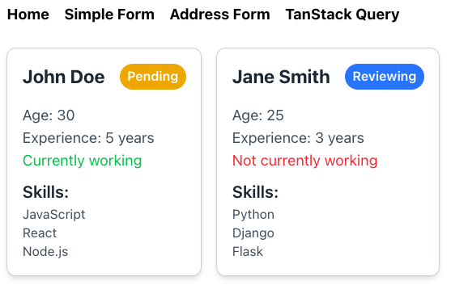

# Módulo 2 - Estilos y Event Handlers en ReactJS

## Previamente

Realizamos la instalación del proyecto, junto con muchas dependencias que nos ayudarán a crear una aplicación web moderna. En este módulo nos enfocaremos en la parte de estilos y eventos. En las clases proximas profundizaremos en las dependencias que instalamos como Form, Store, Router y Shadcn.

## Librerías de estilos

Existen librerías que nos pueden ayudar simplemente usar su conjunto de reglas precargadas o facilitar la definición de estilos, como es el caso de styled-componentes y Tailwind. Este último es el que usaremos en el curso para aplicar estilos de manera más rápida a nuestros componentes.

## Configurar Tailwind en ReactJS (ViteJS)

Actualmente nuestra aplicación ya cuenta el con setup de Tailwind. Sin embargo, nunca esta demás revisar como es el proceso por si en un momento tenemos que hacerlo de manera manual. Seguiremos los pasos de la [documentación](https://tailwindcss.com/docs/guides/vite) oficial de Tailwind:

Para saber cuál es la clase que debemos usar para aplicar un estilo podemos buscarlo en la [documentación](https://tailwindcss.com/docs) de Tailwind 

## Práctica guiada

Para la práctica debemos estilizar nuestro proyecto actual para que luzca lo más similar a lo que tenemos como objetivo. Algunos requisitos son:
- Agrupar a los componentes de manera horizontal.
- Centrarlos de manera tanto vertical como horizontal.
- Añadir un borde y sombra del componente Candidate.
- En caso de que el usuario esté trabajando el texto que lo indica debe ser de color Verde, caso contrario Rojo.
- El texto de cada Candidate debe estar centrado.

## Event Handlers en ReactJS

Los manejadores de eventos en JSX son propiedades que reciben una función. Algunos de estas propiedades pueden enviar parámetros a la función que declaramos, como es el caso de los eventos “onChange”, el cual recibe un evento que contiene el nuevo valor que ha cambiado en el elemento HTML.

## Práctica Event Handlers

Se debe realizar lo siguiente:
- Agregar un botón debajo del componente que tenga como texto `Copiar datos`.
- Al dar clic este debe copiar en el portapapeles los datos del usuario en texto plano y mostrar una alerta en el navegador indicando que los datos han sido copiados exitosamente.

No teman en buscar en internet como acceder o manipular el portapapeles desde el navegador, siempre se debe recurrir a la documentación cuando no se conoce de alguna tecnología o se está aprendiendo de ella.

# Extras

- Leet sobre "Routing Design Patterns" para aplicaciones web.

El sistema de routing que usaremos en el curso es Tanstack Router, el cual es un sistema de enrutamiento que nos permite crear aplicaciones web modernas y escalables. Este sistema es muy flexible y se puede adaptar a diferentes necesidades. Se puede usar:

- File-based routing: Este sistema de enrutamiento se basa en la estructura de archivos del proyecto. Cada archivo que se crea en la carpeta `src/routes` se convierte en una ruta de la aplicación. Este sistema es muy fácil de usar y no requiere configuración adicional.
- Code-based routing: Este sistema de enrutamiento se basa en la configuración del enrutador. Se pueden crear rutas de manera programática y se pueden usar diferentes estrategias de enrutamiento. Este sistema es más flexible y se puede adaptar a diferentes necesidades.

En este curso usaremos el sistema File-based routing, ya que es el más fácil de usar y no requiere configuración adicional. Sin embargo, si en algún momento necesitas usar el sistema Code-based routing, puedes hacerlo sin problemas.

Documentación sobre File-based routing: [Tanstack Router](https://tanstack.com/router/latest/docs/framework/react/routing/route-trees)
