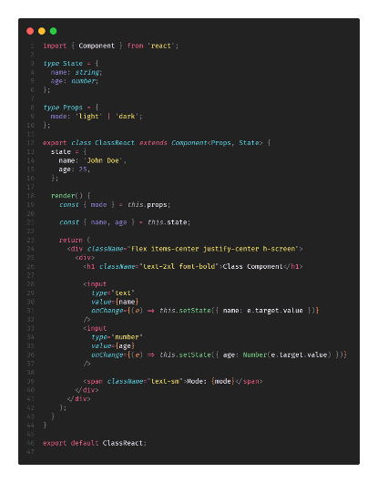
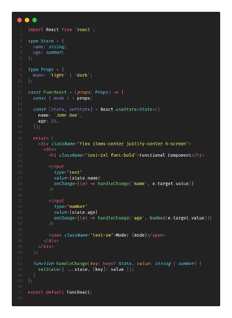

# Módulo 4 - Hooks de ReactJS

## ¿Qué son los Hooks?

Con los componentes funciones no podemos mantener el estado de variables declarándolas con “let” ya que estas se reinicializan en cada render con el valor que escribimos en código. Es por esto que nacieron los Hooks, su traducción es gancho, y es porque permiten “enganchar” la funcionalidad del estado, y como lo veremos más adelante, administrar el Ciclo de vida del componente en Componentes funcionales y muchas más funcionalidades y características que podemos encapsular en Hooks.

## ¿Cómo se realizaba antes?

En los componentes Clase la administración del ciclo de vida y el manejo de estado se obtenía por herencia de la clase Component de ReactJS. Estas nos daban funciones tales como componentDidUpdate, componentWillUnmount, setState y demás que permitían la modificación del estado y administración del ciclo de vida del componente.

Componente Clase:



Componente Funcional:



## Principales Hooks de ReactJS

A continuación, se presentan los principales Hooks de ReactJS, para mas info puedes visitar la [esta documentación de la comunidad](https://www.codecademy.com/learn/react-101/modules/react-hooks-u/cheatsheet):

- useState, administración de estados, pueden ser primitivos, JSON, clases, etc.
- useEffect, admintración del life cycle del componente, lo veremos más adelante del curso. Dato, este siempre se ejecuta después de que el componente de haya renderizado por algún cambio.
- useContext, usado para obtener el estado global cuando usamos React Context como Global Store
- useLayoutEffect, se invoca muy similar que el useEffect, con la diferencia de que se invoca antes del render. Puede afectar al rendimiento según su implementación.
- useReducer, usado principalmente como alternativa del useState, para simplificar la invocación al querer actualizar el estado.
- useCallback, usado principalmente para evitar que funciones se redefinan en cada render. Limitando su re-definicion según una lista de dependencias. Así logramos que por ejemplo componentes que reciben estas funciones o valores se vuelvan a renderizar a pesar de que los valores que usan no hayan cambiado. Este se usa en funciones no en Componentes.
- useMemo, muy similar a useCallback, pero esta enfocado a memorizar VALORES, estos también pueden ser Componentes. Por lo que se puede usar para que un componente solo sea re-renderizado según la lista de dependencias que se declare.
- useRef, usado para almacenar valores en toda la vida de un componente, puede parecerse mucho a useState, pero este no retorna una función para actualizar el estado. Su uso principal es para guardar referencias de Componentes para así invicar funciones de ellos de manera programáticas.

# Usando Hooks

Para esta práctica crearemos un nuevo endpoint `candidate/form/:id?` que nos permita crear un nuevo usuario o editar uno existente. El formulario de esta página debe contener los siguientes campos:

- Name, un input de texto.
- Age, un input de número.
- Experience, un input de texto.
- Status, un select con las opciones “Pending”, “Reviewing, “Accepted” y “Rejected”.
- Skills, un input de texto. (Separar por comas)
- Working, un checkbox.

Se deben cumplir los siguientes requerimientos al usar los hooks:
- useState, para administrar el type “Form” que tendrá los datos del formulario. En siguientes prácticas se verá como usar Form de Tanstack para validar los datos.

1. Crear los componentes de input necesarios en la carpeta `src/components/form`.
   - check
   - input (el cual puede ser de tipo number o select)
   - select
2. Crear la nueva ruta en `src/routes/form/$id.tsx` que contenga el formulario y cumpla con los requerimientos. Usar los componentes creados. Dejar la lógica del guardado para después.

# Implementación de Datasource/Repository

Es importante todo este background de ReactJS porque esta librería al no ser un framework es muy fácil perderse en malas prácticas de código, estructura de proyecto y de más que después provocarán que sea muy difícil de mantener y adoptar para nuestros programadores. Se debe siempre estar al tanto de los patrones y buenas prácticas para aplicarlas de la mejor manera en todo proyecto.

La estructura de carpetas de nuestro proyecto será la siguiente:
```
src/
  api/
    datasource/
      index.ts  <- Aquí es donde exportaremos la instancia de nuestro Repositorio para que sea usado en toda la aplicación.
    domain/
      ds/
        DataDS.ts <- Aquí definiremos la interfaz de nuestro Datasource (las funciones que debe implementar).
    impl
      ds/
        LocalStorageDS.ts <- Aquí implementaremos la lógica de nuestro Datasource usando LocalStorage.
      repo/
        DataRepoImpl.ts <- Aquí implementaremos la lógica de nuestro Repositorio que hará uso de nuestro Datasource.
  ...
  components/
    ...
    form/
      check.tsx
      input.tsx
      select.tsx
  routes/
    ...
    form/
      $id.tsx
  ...
```

Los pasos a seguir son los siguientes:
1. Crear la carpeta `domain` y `impl` dentro de `api`.
2. En la carpeta `domain` crear la carpeta `ds` y dentro de ella el archivo `DataDS.ts`. En este archivo definiremos la interfaz `DataDS` que contendrá las funciones que debe implementar nuestro Datasource, el contenido seria este:
      
```typescript
abstract class DataDS {
  abstract getCandidateS(state?: string): Promise<Array<CandidateType>>;

  abstract getCandidateById(id: string): Promise<CandidateType>;

  abstract saveCandidate(candidate: CreateCandidateType): Promise<boolean>;

  abstract updateCandidate(candidate: UpdateCandidateType): Promise<boolean>;
}

export default DataDS;
```
3. En la carpeta `impl` crear la carpeta `ds` y dentro de ella el archivo `LocalStorageDS.ts`. En este archivo implementaremos la lógica de nuestro Datasource usando LocalStorage, el contenido seria este:
```typescript
const CANDIDATES_KEY = 'candidates'

const sleep = (ms = 500) => new Promise((resolve) => setTimeout(resolve, ms))

class LocalStorageDS implements DataDS {
  async getCandidates(status?: string) {
    try {
      await sleep()

      const candidatesRaw = localStorage.getItem(CANDIDATES_KEY) ?? '[]'

      const candidates = JSON.parse(candidatesRaw) as Array<CandidateType>

      return candidates.filter((candidate) => {
        if (status) {
          return candidate.status === status
        }

        return true
      })
    } catch (error) {
      console.error(error)
      throw new Error('Error loading users')
    }
  }

  async getCandidateById(id: string): Promise<CandidateType> {
    try {
      await sleep()

      const candidatesRaw = localStorage.getItem(CANDIDATES_KEY) ?? '[]'

      const candidates = JSON.parse(candidatesRaw) as Array<CandidateType>

      const candidate = candidates.find((c) => c.id === id)

      if (!candidate) {
        throw new Error('Candidate not found')
      }

      return candidate
    } catch (error) {
      console.error(error)
      throw new Error('Error loading user')
    }
  }

  async saveCandidate(candidate: CreateCandidateType): Promise<boolean> {
    try {
      await sleep()

      const candidatesRaw = localStorage.getItem(CANDIDATES_KEY) ?? '[]'

      const candidates = JSON.parse(candidatesRaw) as Array<CandidateType>

      const newCandidate: CandidateType = {
        ...candidate,
        id: crypto.randomUUID(),
        status: 'Pending',
      }

      candidates.push(newCandidate)

      localStorage.setItem(CANDIDATES_KEY, JSON.stringify(candidates))

      return true
    } catch (error) {
      console.error(error)
      throw new Error('Error saving user')
    }
  }

  async updateCandidate(candidate: UpdateCandidateType): Promise<boolean> {
    try {
      await sleep()

      const candidatesRaw = localStorage.getItem(CANDIDATES_KEY) ?? '[]'

      const candidates = JSON.parse(candidatesRaw) as Array<CandidateType>

      const candidateIndex = candidates.findIndex((c) => c.id === candidate.id)

      if (candidateIndex === -1) {
        throw new Error('Candidate not found')
      }

      candidates[candidateIndex] = {
        ...candidates[candidateIndex],
        ...candidate,
      }

      localStorage.setItem(CANDIDATES_KEY, JSON.stringify(candidates))

      return true
    } catch (error) {
      console.error(error)
      throw new Error('Error updating user')
    }
  }
}

export default LocalStorageDS
```
4. En la carpeta `impl` crear la carpeta `repo` y dentro de ella el archivo `DataRepoImpl.ts`. En este archivo implementaremos la lógica de nuestro Repositorio que hará uso de nuestro Datasource, el contenido seria este:
```typescript
class DataRepoImpl {
  constructor(private data: DataDS) {}

  async loadUsers(state?: string): Promise<UserLoaderData> {
    return await this.data.loadUsers(state);
  }

  async loadUserById(id: string): Promise<UserByIdLoaderData> {
    return await this.data.loadUserByIndex(index);
  }

  async saveUser(user: UserCreate): Promise<void> {
    return await this.data.saveUser(user);
  }

  async updateUser(id: string, user: UserCreateType): Promise<void> {
    return this.data.updateUser(id, user);
  }
}

export default DataRepoImpl;
```

> Implementar el código de datasource/index.ts con la creación de las instancias

```ts
import LocalStorageDS from '../impl/ds/LocalStorageDS'

import DataRepoImpl from '../impl/repo/DataRepoImpl'

const LS = new LocalStorageDS()
const DataRepo = new DataRepoImpl(LS)

export default DataRepo
```

Como se puede observar, la clase abstracta `DataDS` nos sirve para definir las funciones que debe implementar nuestro Datasource, en este caso `LocalStorageDS`. La clase `LocalStorageDS` implementa la lógica de nuestro Datasource usando LocalStorage. La clase `DataRepoImpl` implementa la lógica de nuestro Repositorio que hará uso de nuestro Datasource el cual se le pasa en el constructor.

Este diseño nos permite tener una separación de responsabilidades y una fácil escalabilidad de nuestro proyecto. Además, nos permite cambiar fácilmente la implementación de nuestro Datasource sin afectar al resto de la aplicación, por si un dia usamos por ejemplo una API REST o Firebase en lugar de LocalStorage.

## Extra (Tarea)

Crear un botón en el componente `Candidate` que se llame “Eliminar” de color rojo. Este deberá invocar una nueva función en nuestro DataSource “deleteUser” que recibe el id del usuario y lo elimina de la base de datos.

> HINT: Deben deben definir la nueva firma de la función en el archivo `src/api/domain/ds/DataDS.ts` y luego implementarla en el archivo `src/api/impl/ds/LocalStorageDS.ts`. Luego deben implementar la lógica de eliminación en el archivo `src/api/impl/repo/DataRepoImpl.ts`.
> En el archivo `src/components/candidates.tsx` deben implementar la lógica de invocación de la función y el botón de eliminar.


# React Query

Existen muchas libs que nos pueden ayudar a resolver tareas, ahora revisaremos una que se llama react-query. Otras muy útiles para otras tareas son:
- Mantine, para componentes UI y también dispone de muchos hooks
- React-hook-form, para formularios.
- moment.js, para manejo de fechas.
- Axios, para peticiones HTTP.
- React-leaflet, para mapas.


1. Revisar como la implementación esta realizada en `src/integrations/tanstack-query/root-provider.tsx`. El Provider QueryClientProvider en nuestro archivo `src/main.tsx` para envolver toda la aplicación.
2. Crear las constantes para los keys de cada query en el archivo `src/constants/query.ts`.
3. Crear funciones utils para detectar cuando este cargando una query en el archivo `src/lib/query.ts`.
4. Hacer uso de la función useQuery/useMutation:
   1. En el archivo `src/routes/form/$id.tsx` importar la función `useQuery` y usarla para obtener los datos del formulario (pre-cargar) y `useMutation` para guardar los datos del formulario.
      - Hacer uso del queryKey.
      - Hacer uso de `enable` param.
   2. En el archivo `src/routes/candidates.tsx` importar la función `useQuery` y usarla para obtener los datos de los candidatos.
